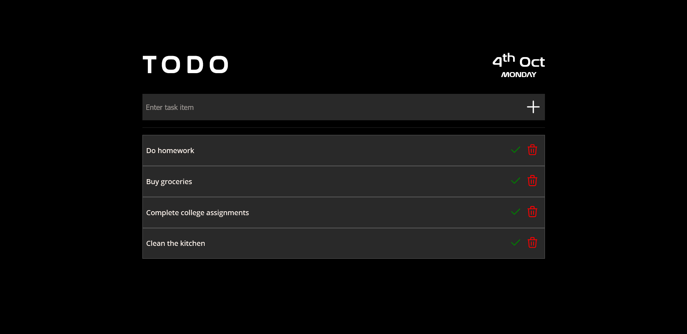

# Todo-app
A simple todo list app built using HTML, CSS and Vanilla JavaScript.

Live deployment: [Link](https://vaishnav-sh.github.io/todo-app/)

## Running the project
To run this project locally you need to first fork it and then clone it<br>
Using SSH:
```
git clone git@github.com:<your_github_username>/todo-app.git
```
Using HTTPS
```
git clone https://github.com/<your_github_username>/todo-app.git
```

## Contributing to the project
To make any contributions, follow the below steps and also don't forget to star this repository.<br>
1. Fork this repository and clone it<br>
Using SSH:
```
git clone git@github.com:<your_github_username>/todo-app.git
```
Using HTTPS
```
git clone https://github.com/<your_github_username>/todo-app.git
```
<br>

2. Create a new branch and switch to it
```
cd todo-app
git checkout -b <new_branch_name>
```
<br>

3. Make the changes to the code on that branch, commit and then push to GitHub.
```
git push origin <new_branch_name>
```
4. Create a Pull Request for your changes.

<br>

## User Interface

